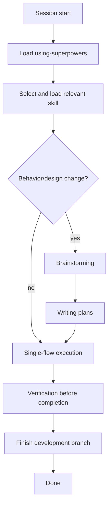

# Antigravity Superpowers Current Flow

This document explains the active workflow used by the Antigravity profile in this folder.

## 1) Session Start

1. Load rules from `.agent/AGENTS.md`.
2. Load `.agent/skills/using-superpowers/SKILL.md`.
3. Before any action, check whether a relevant skill should be loaded from:
   - `.agent/skills/<skill-name>/SKILL.md` (preferred)
   - `~/.gemini/skills/<skill-name>/SKILL.md` (fallback)
4. Ensure `<project-root>/docs/plans/task.md` exists as a list-only table (no instructions).

## 2) Skill-First Routing

For each user request:

1. Identify the best matching skill.
2. Announce and follow that skill.
3. If the skill has a checklist, track progress in `<project-root>/docs/plans/task.md`.

## 3) Design Before Implementation

If the request involves creating/changing behavior:

1. Run `brainstorming`.
2. Explore context and ask clarifying questions.
3. Propose approaches and get approval.
4. Write design doc to `docs/plans/YYYY-MM-DD-<topic>-design.md`.
5. Move to `writing-plans`.

## 4) Planning Stage

`writing-plans` creates a detailed implementation plan:

1. Save plan to `docs/plans/YYYY-MM-DD-<feature-name>.md`.
2. Break work into small, verifiable steps.
3. Include exact files, commands, and expected outputs.
4. Handoff to execution via `.agent/workflows/execute-plan.md` (single entrypoint).
5. The workflow loads `executing-plans`, which enforces `single-flow-task-execution` rules.

## 5) Execution Model (Single-Flow)

Core execution rules from `.agent/AGENTS.md` and `single-flow-task-execution`:

1. One active task at a time.
2. One coding execution thread at a time.
3. Use `task_boundary` for coding tasks.
4. Use `browser_subagent` only for browser-specific tasks.
5. Update `<project-root>/docs/plans/task.md` on every task state change.

Per-task loop:

1. Mark task `in_progress`.
2. Implement scoped change.
3. Run verification commands.
4. Fix and re-run until passing.
5. Mark task `done` with notes.

## 6) Verification Gate

Before any completion claim (`verification-before-completion`):

1. Identify the command that proves the claim.
2. Run it now (fresh).
3. Read full output and exit code.
4. Report evidence.
5. Only then claim completion.

## 7) Finish Branch

After all tasks are complete and verified (`finishing-a-development-branch`):

1. Re-run required tests.
2. Present workflow options (merge, PR, keep branch, discard).
3. Execute selected option safely.
4. Require explicit confirmation for destructive actions.

## 8) Profile Validation Flow

Validate this profile itself with:

```bash
bash templates/.agent/tests/run-tests.sh
```

`run-tests.sh` calls `check-antigravity-profile.sh`, which verifies:

- Required files exist
- Skill frontmatter is valid
- Legacy patterns are removed
- AGENTS mapping contract is present

## Flow Diagram


