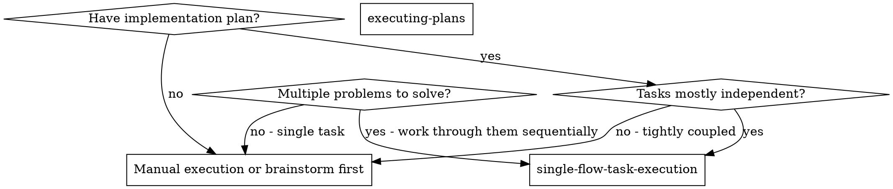
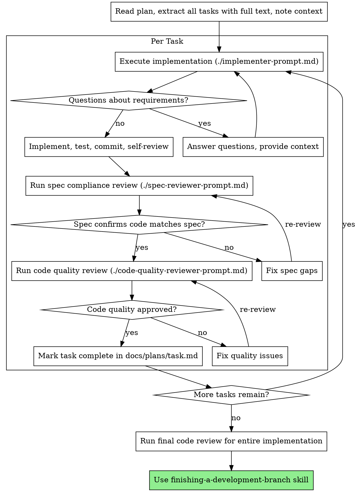

# Single-Flow Task Execution

Execute plans by working through one task at a time with two-stage review after each: spec compliance review first, then code quality review.

**Core principle:** One task at a time + two-stage review (spec then quality) = high quality, disciplined iteration.

## Antigravity Execution Model

Antigravity does NOT support parallel coding subagents. All work happens in a single execution thread.

**Rules:**

1. **One active task only** — never work on multiple tasks simultaneously.
2. **One execution thread only** — no parallel dispatch.
3. **No parallel coding subagents** — Antigravity does not have `Task(...)`.
4. **Browser automation** may use `browser_subagent` in isolated steps.
5. **Track progress** by updating `<project-root>/docs/plans/task.md` at each state change (table-only tracker).
6. **Use `task_boundary`** to clearly delineate each unit of work.

## When to Use



**Use when:**

- You have an implementation plan with multiple independent tasks
- 2+ test files failing with different root causes (work through them one at a time)
- Multiple subsystems broken independently
- Each problem can be understood without context from others
- Structured execution with quality gates is needed

**Don't use when:**

- Failures are related (fix one might fix others) — investigate together first
- Tasks are tightly coupled and need full system understanding
- Single simple task that doesn't need review structure

**vs. Executing Plans (worktree-based):**

- Same session (no context switch)
- Fresh `task_boundary` per task (clean scope)
- Two-stage review after each task: spec compliance first, then code quality
- Faster iteration (no human-in-loop between tasks)

## The Process



## Task Decomposition

When facing multiple problems (e.g., 5 test failures across 3 files):

### 1. Identify Independent Domains

Group failures by what's broken:

- File A tests: User authentication flow
- File B tests: Data validation logic
- File C tests: API response handling

Each domain is independent — fixing authentication doesn't affect validation tests.

### 2. Create Task Units

Each task gets:

- **Specific scope:** One test file or subsystem
- **Clear goal:** Make these tests pass / implement this feature
- **Constraints:** Don't change unrelated code
- **Expected output:** Summary of what changed and verification results

### 3. Execute Sequentially with Review

Work through each task one at a time using the full review cycle.

### 4. Review and Integrate

After all tasks:

- Run full test suite to verify no regressions
- Check for conflicts between task changes
- Run final code review on entire implementation

## Task Brief Structure

For each task, prepare:

```
task_boundary:
  description: "Implement Task N: [task name]"
  prompt: |
    ## Task Description
    [FULL TEXT of task from plan — paste it here]

    ## Context
    [Where this fits, dependencies, architectural context]

    ## Constraints
    - Only modify [specific files/directories]
    - Follow existing patterns in the codebase
    - Write tests for new functionality

    ## Verification
    - Run: [specific test command]
    - Expected: [what success looks like]
```

**Key:** Provide full task text and context upfront. Don't make the task boundary re-read the plan file.

## Review Templates

This skill includes prompt templates for structured reviews:

- **`./implementer-prompt.md`** — Template for implementation task boundaries
- **`./spec-reviewer-prompt.md`** — Template for spec compliance review (did we build what was requested?)
- **`./code-quality-reviewer-prompt.md`** — Template for code quality review (is it well-built?)

**Review order matters:** Always run spec compliance FIRST, then code quality. There's no point reviewing code quality if the implementation doesn't match the spec.

## Checkpoint Pattern

At logical boundaries (after each task, at major milestones), report:

- **What changed** — files modified, features implemented
- **What verification ran** — test results, lint results
- **What remains** — remaining tasks, known issues

Update `docs/plans/task.md` with current status.

## Common Mistakes

**Task scoping:**

- **Bad:** "Fix all the tests" — loses focus
- **Good:** "Fix user-auth.test.ts failures" — clear scope

**Context:**

- **Bad:** "Fix the validation bug" — unclear where
- **Good:** Paste error messages, test names, relevant code paths

**Constraints:**

- **Bad:** No constraints — task might refactor everything
- **Good:** "Only modify src/auth/ directory"

**Output:**

- **Bad:** "Fix it" — no visibility into what changed
- **Good:** "Report: root cause, changes made, test results"

**Reviews:**

- **Bad:** "It works, move on" — quality debt
- **Good:** Implement then spec review then quality review then next task

## Example Workflow

```
You: I'm using single-flow-task-execution to execute this plan.

[Read plan file: docs/plans/feature-plan.md]
[Extract all 5 tasks with full text and context]
[Update docs/plans/task.md with all tasks as 'not_started']

--- Task 1: Hook installation script ---

[Prepare task brief with full text + context]
[Execute implementation following ./implementer-prompt.md structure]

Questions: "Should the hook be installed at user or system level?"
Answer: "User level (~/.config/superpowers/hooks/)"

Implementation:
  - Implemented install-hook command
  - Added tests, 5/5 passing
  - Self-review: Found I missed --force flag, added it
  - Committed

[Run spec compliance review following ./spec-reviewer-prompt.md]
Spec review: Spec compliant — all requirements met, nothing extra

[Run code quality review following ./code-quality-reviewer-prompt.md]
Code review: Strengths: Good test coverage, clean. Issues: None. Approved.

[Mark Task 1 complete in docs/plans/task.md]

--- Task 2: Recovery modes ---

[Prepare task brief with full text + context]
[Execute implementation]

Implementation:
  - Added verify/repair modes
  - 8/8 tests passing
  - Self-review: All good
  - Committed

[Run spec compliance review]
Spec review: Issues found:
  - Missing: Progress reporting (spec says "report every 100 items")
  - Extra: Added --json flag (not requested)

[Fix issues: remove --json flag, add progress reporting]
[Run spec compliance review again]
Spec review: Spec compliant now

[Run code quality review]
Code review: Issue (Important): Magic number (100) should be a constant

[Fix: extract PROGRESS_INTERVAL constant]
[Run code quality review again]
Code review: Approved

[Mark Task 2 complete in docs/plans/task.md]

... [Continue through remaining tasks] ...

[After all tasks complete]
[Run final code review on entire implementation]
Final review: All requirements met, ready to merge

[Use finishing-a-development-branch skill]
Done!
```

## Red Flags

**Never:**

- Start implementation on main/master branch without explicit user consent
- Skip reviews (spec compliance OR code quality)
- Proceed with unfixed review issues
- Work on multiple tasks simultaneously
- Skip scene-setting context (task needs to understand where it fits)
- Accept "close enough" on spec compliance (reviewer found issues = not done)
- Skip review loops (reviewer found issues = fix = review again)
- Let self-review replace actual review (both are needed)
- **Start code quality review before spec compliance passes** (wrong order)
- Move to next task while either review has open issues

**If you have questions about requirements:**

- Ask clearly and wait for answers
- Don't guess or make assumptions
- Better to ask upfront than rework later

**If reviewer finds issues:**

- Fix them
- Run reviewer again
- Repeat until approved
- Don't skip the re-review

## Completion

Before claiming all work is done:

1. Ensure all task entries in `docs/plans/task.md` are `done` or `cancelled`
2. Run full test/validation command
3. Verify no regressions across all tasks
4. Summarize evidence (test output, review approvals)

## Advantages

**Structured execution:**

- Clear task boundaries prevent scope creep
- Review gates catch issues early (cheaper than debugging later)
- Progress tracking provides visibility

**Quality gates:**

- Self-review catches obvious issues before handoff
- Two-stage review: spec compliance prevents over/under-building, code quality ensures maintainability
- Review loops ensure fixes actually work

**Efficiency:**

- Provide full task text upfront (no re-reading plan files)
- Controller curates exactly what context is needed
- Questions surfaced before work begins (not after)
- Sequential execution avoids conflicts between tasks

## Integration

**Required workflow skills:**

- **using-git-worktrees** — Set up isolated workspace before starting
- **writing-plans** — Creates the plan this skill executes
- **requesting-code-review** — Code review template for quality reviews
- **finishing-a-development-branch** — Complete development after all tasks

**Should also use:**

- **test-driven-development** — Follow TDD for each task
- **verification-before-completion** — Final verification checklist

**Alternative workflow:**

- **executing-plans** — Use for worktree-based parallel session execution
